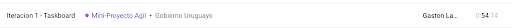
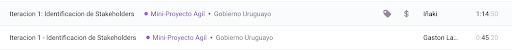
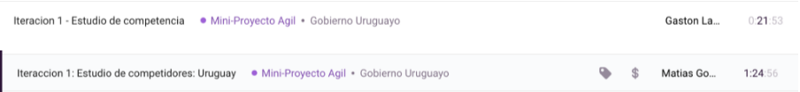
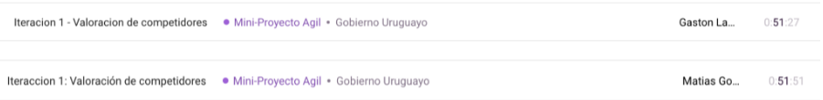
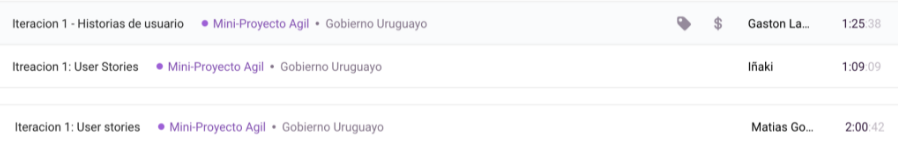
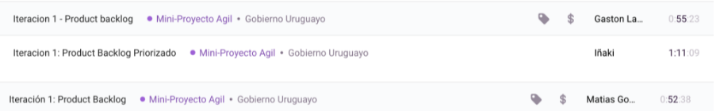
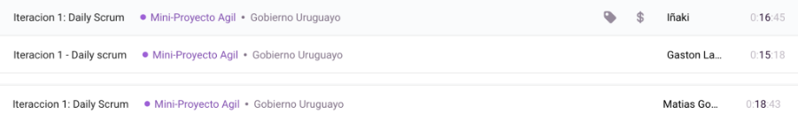
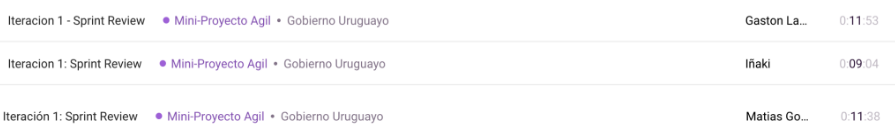
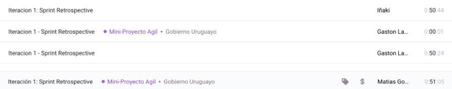

# DOCUMENTACIÓN Mini-Proyecto Agil

## COSAS GENERALES:
### ROLES:

<ins>Integrantes:</ins>
- Gaston - 238473
- Matias - 219329
- Iñaki  - 241072

<ins>Roles:</ins>
Definimos los roles a base de preferencia.

Iñaki se ofrecio a ser el Product Owner.
Gaston quiso ser el Scrum Master.
Matias no tuvo preferencia.

<ins>Los Roles quedaron:</ins>
- Scrum Master: Gaston
- Product Owner: Iñaki
- Developer: Matias

### Primer Marco de Trabajo:
Para el trabajo vamos a seguir las guías de Scrum (https://scrumguides.org/scrum-guide.html
), aunque no en su absoluta pureza:
- Para cada iteración planeamos entregar documentos, no necesariamente ejecutables.
- Los Daily Scrums se harán en los días en que el grupo se junta a trabajar. Esto se debe a que no se trabajara todos los días de la semana en equipo ya que cada uno tiene sus tiempos y responsabilidades en estos tiempos de emergencia sanitaria. Exceptuando los primeros días de sprint porque se desarrollará el sprint planning.

Fuera de estas excepciones, planeamos trabajar con el formato clásico de Scrum, iniciando un Sprint de 2 semanas de duración con un Sprint Planning, seguidas de Daily Scrum y concluyendo con un Sprint Review y Retrospective.

En el Sprint Planning definimos los objetivos del sprint.

En el día a día, hacemos un Daily Scrum inicial y al final del mismo se hace un registro de las horas trabajadas por miembro del equipo.

Hacia el final del Sprint hacemos el Sprint Review y vemos como nos acercamos al Product Goal.

Antes de entregar la iteración, hacemos un sprint retrospective donde re-definimos estos puntos que estamos definiendo ahora.

### Herramientas:
Las primeras dos herramientas definidas fueron:
- Para división de tareas: Trello
- Para llevar cuenta del tiempo trabajado: Toggl Track
- Documentación: Markdown
- Versionado: GitHub y GitHub Desktop

En Toggl Track cada miembro del Scrum Team debe activar el contador sobre el proyecto llamado “Mini-Proyecto Ágil” cuando estemos trabajando. Este primer día de planificación no fue monitoreado (2 horas todos).

En Trello tenemos un Task board donde iremos monitoreando cada iteración.

## Iteracion 1 

### Sprint planning

##### Valor del Sprint
Este primer sprint habilita a las demás iteraciones mediante la planificación del proyecto. En este primer sprint, buscaremos determinar el Product Backlog del producto mediante el listado de posibles funcionalidades logrado por la identificación de stakeholders y el estudio de competidores.

##### Que hay que hacer:

- Identificación de interesados
- Lista de funcionalidades por interesado
- Estudio de competidores
- Historias de usuario (BDD)
- Criterios de aceptación
- Product backlog

##### Cómo lo haremos:
###### 1er semana
| Tareas      | Duracion(hs) | Esfuerzo(hs) |
| ----------- | --- | ---|
| Identificación de interesados      | 2       | 2|
| Lista de funcionalidades por interesado    | 2        | 6 |
| Estudio de competidores.    | 2        | 4 |

###### 2da semana
| Tareas      | Duracion(hs) | Esfuerzo(hs) |
| ----------- | --- | ---|
| Historias de usuario (BDD)      | 3       | 9 |
| Product backlog   | 1        | 3 |
| Creación de taskboard de Product backlog  | 1        | 3 |

##### Sprint Goal
Una identificación clara del problema acompañado de un product backlog que define las funcionalidades más importantes del sistema de manera ordenada

#### Identificación de Stakeholders:

La naturaleza de la aplicación nos permite identificar los siguientes stakeholders:

- Adolescentes y Adultos Jóvenes entre 13 - 35 años

Son la gente activa de la población más propensa a las actividades sociales. Su interés se encuentra en balancear entre poder realizar actividades sociales y asegurar la seguridad de él mismo y sus allegados. Son gente que están acostumbrados a manejar la tecnología y las aplicaciones móviles. Alta cantidad de gente.

- Adultos entre 35 - 60 años

Son gente activa que es un poco menos propensa a las actividades sociales fuera de las familiares. Son la población que hay más probabilidades de que estén instauradas con una familia en el Uruguay. Su interés se encuentra en asegurarse que su núcleo familiar esté protegido e informado de la situación de la pandemia. El manejo de la tecnología sigue siendo bueno, pero varía fuertemente por cuartil del grupo. Alta cantidad de gente.

- Adultos mayores de 60 años

Son gente no muy activa, pero que son población de riesgo. Su interés se encuentra en estar informados sobre la situación sanitaria y minimizar lo más posible el riesgo de contagio (ya que son población de riesgo). Quieren poder ver a sus familias con la conciencia limpia de que tanto ellos como su núcleo familiar están a salvo de la enfermedad. Suelen tener un mal manejo de la tecnología y no estar muy acostumbrados a las aplicaciones móviles. Como Uruguay es un país que se reconoce por tener una población mayor, hay una alta cantidad de este stakeholder en comparación con otros países.

Los tres grupos de stakeholders anteriores presentan una gran parte de la población como muestra la siguiente información:

(Información del censo Uruguayo del 2011, source: [Instituto Nacional de Estadística](https://www.ine.gub.uy/documents/10181/35289/analisispais.pdf))

Como muestra el censo, aproximadamente el 80% de la población uruguaya comprende a nuestros stakeholders más importantes. Es decir, idealmente cerca de al menos 2.700.000 personas utilizarían la aplicación extensivamente.

Estos tres stakeholders también son fuertes candidatos a ser la fuente de información sobre los casos de contagio, ya que la población es tan numerosa, se requiere de un esfuerzo comunitario para poder tener toda la información posible sobre casos de contagio. Además, los usuarios estarían interesados a compartir su información siempre y cuando se respete la privacidad de la misma. Es de su interés poder acceder a su carnet de vacunación, un documento validado por el gobierno que afirma que la persona está efectivamente vacunada.

- Gobierno Uruguayo

La aplicación es de un alto interés para el gobierno uruguayo ya que asiste con su interés principal de mantener sanitariamente al país con la acción de informar al pueblo uruguayo. Sería un agente importante en la recolección y aprobación de la información requerida para que funcione la aplicación.

- Sociedades médicas

Son todos los prestadores de salud. Estos intentan asegurar el bienestar de sus pacientes frente al peligro provocado por la contracción del virus COVID-19. Estas sociedades presentan mucha inquietud ante los incrementos de casos exponenciales y desean minimizar la curva de contagio para no sobresaturar sus camas de CTI y poder atender a todos sus afiliados. Al ser aquellos que se encuentran en el frente combatiendo la enfermedad, son los candidatos principales a otorgar la primera información sobre los casos activos de COVID-19.

- Laboratorios de test de COVID-19

Tanto públicos como privados tienen el objetivo de minimizar el tiempo de espera ante un resultado manteniendo una alta tasa de eficacia. Son responsables de informar la cantidad de casos positivos que se dieron por día.

#### Identificación de Funcionalidades

De la identificación de Stakeholders identificamos las siguiente funcionalidades por stakeholder:

Un punto importante encontrado en la identificación de stakeholders fue que gran parte de los usuarios buscan información relevante a la situación sanitaria en busca de sentirse que ellos y sus familias están seguros. Por lo tanto identificamos que la aplicación debe:

- Otorgar información sobre el estado de los casos de la enfermedad:
    - Cantidad de casos activos en el Uruguay.
        - En el dia.
        - Totales.
    - Índices y estadísticos relevantes a estos (índice Harvard).
    - Cantidad de tests realizados.
        - En el dia.
        - Totales.
    - Cantidad de tests positivos en el dia.
    - Cantidad de dosis de vacunas otorgadas.
        - En el dia.
        - Totales.
    - Localización de los centros de vacunación conocidos.
        - Y la cantidad de dosis que poseen
- Esta información debe ser relevante geográficamente, como nuestro público objetivo es el pueblo uruguayo, solo interesa otorgar la información anterior en Uruguay. Pero además, segmentar esta información para todos los departamentos del país.
    - Debe de poder darnos un heatmap del país que nos indica la situación en cada departamento.
- Poder saber si hubo contacto con un positivo o si un usuario estuvo cerca de un positivo.
    - Para poder saber esto, es necesario poder trackear al usuario geográficamente.
    - Esto último puede ir en contra de otra funcionalidad identificada más adelante.
- Otorgar información sobre posibles síntomas de la enfermedad, que significan estos en términos de probabilidad de contagios y qué hacer si se identifica alguna de estas. Además, sería necesario dar la posibilidad de agendar un hisopado en la aplicación.
- Otorgar información sobre atención psicológica, ya que se ha estado hablando mucho de la pandemia psicológica que vino con la situación sanitaria.
    - Puntos de contacto con expertos en psicología.
    - Mecanismos para tratar la soledad en estos tiempos de pandemia.
- En relación con lo anterior, debería de también ser posible agendar la vacunación de uno mismo para cierto horario en cierta agencia.
- Otorgar la posibilidad de registrar varias personas por teléfono (multiusuario), ya que en un núcleo familiar lo más normal es que uno sea el conocedor tecnológico, y este lo haría para toda su familia.

Para poder otorgar las funcionalidades anteriores, y dado que el público objetivo es masivo (al menos 2.7 millones de personas), es necesario otorgar una infraestructura de recolección de información escalable:
- La aplicación debe de tener acceso a la base de datos de COVID del Uruguay. A medida que se agregue información, esta se debe reflejar en la aplicación.
- Los usuarios deben de poder alimentar información al sistema, como por ejemplo el hecho de que un usuario haya estado en contacto con un positivo.
- Debe ser accesible por una cantidad de dispositivos masivos. Los dispositivos móviles son los más masivos del mercado hoy en día, por lo cual debería de ser una aplicación móvil por lo menos.

Para los usuarios más jóvenes es de suma importancia poder mantener movimiento en sus vidas. Para ello, la información otorgada les sirve para poder manejarse de manera segura, pero además es de su interes que ellos puedan comprobar su sanidad a empresas (e.g: empresas hoteleras, empresas de fiestas) las cuales desean mantener la sanidad en sus establecimientos:
- La aplicación debe de poder emitir documentos oficiales gubernamentales que comprueben que alguien se encuentra vacunado.

La aplicación es de distribución masiva, esto significa que los usuarios mayores también van a tener mano en la aplicación, los cuales identificamos que no necesariamente tienen buen manejo de la tecnología, por lo que:
- Es necesario que la aplicación sea fácil e intuitiva de utilizar para toda la población.
- Por encima de esto, se debe otorgar una guía de uso o un tutorial que sea fácil de entender, concisa y efectiva.
- Fuera de la guía, debe de haber un punto de acceso a todas las guías y tutoriales, los cuales otorgan aún más información para los interesados.

Vivimos en una época en la cual la seguridad de la información es vital para los usuarios, por lo tanto:
- Es necesario mantener un nivel básico de seguridad informática, encriptados y demás.
- Se debe mantener la privacidad de la información del usuario.
- En caso de publicar información del usuario, se debe pedir el consenso al mismo antes de llevar a cabo la publicación.
El usuario debe de poder editar qué información desea compartir. E.g: Localización geográfica.

Como ya mencionamos, cerca de 3 millones de usuarios van a utilizar la aplicación, por lo cual:
- La infraestructura de base de datos de la misma debe de poder ser rápida y efectiva incluso para cantidades masivas de información.
- La eficiencia de los mecanismos de redes no debe de bajar a pesar de la cantidad de usuarios activos.

Para las sociedades médicas, es de especial interés que la aplicación acerque a los pacientes a acceder sus servicios por lo que:
- La aplicación debe de otorgar puntos de contacto con sociedades médicas del país.
    - Por ejemplo, un botón de emergencia que notifica a cierta sociedad médica del país.
- La aplicación debe de poder recomendar centros de salud cercanos al usuario en caso de que los usuarios no se encuentren en un buen estado por el COVID.
- La aplicación debe de poder otorgar información sobre la cantidad de camas disponibles de CTI.

#### Estudio de competidores:
<ul>
    <li>COVID-19MX</li>
</ul>

Comentarios:
- Brinda una pequeña serie de preguntas para saber si el usuario tiene posibilidades de tener covid
“Autodiagnóstico: En caso de sospecha de que tu o algún familiar sufrieron el contagio, responde al cuestionario y tendrás las recomendaciones para actuar y de ser necesario acudir para atención médica.”
- Acceso directo al teléfono de atención epidemiológica sanitaria.
- Permite la entrada a la app de forma anónima pero se restringen funciones. Estas funciones son las de registrar datos. Se restringen para no permitir el descontrol estadístico.
- Identifica los Centros de Atención más cercanos a tu ubicación, puedes consultar por Estados o mediante un mapa que te muestra el domicilio y ruta para llegar.
- Ofrece la información más importante para entender qué es, cómo se transmite y los grupos más vulnerables en torno al COVID. Además da consejos.
- Noticias: Acceso a la información oficial incluyendo conferencias de prensa y comunicados de la Secretaría de Salud.
- Desescalada: información sobre la fase en la que se encuentran los estados. Permite guardar favoritos y te avisan si hay cambio de fase.
- Permite el ingreso de más de una persona por teléfono.

Contras: 
- Es un bombardeo de información que puede no resultar muy clara al usuario.
- Los formularios requieren demasiados datos para completar

Se encuentra disponible en la [app store](https://play.google.com/store/apps/details?id=mx.gob.www) para android 6.0 y versiones posteriores, Requiere iOS 13.5 o posterior.

<ul>
    <li>CoronaMadrid</li>
</ul>

Comentarios
- Cuenta con una guía para uso primerizo.
- Para acceder a la app se debe ingresar usuario, si no no permite acceso a las demás funciones.
- Posee un cuestionario para la autoevaluación de los síntomas y unas recomendaciones personalizadas según la respuesta del usuario.
- En caso de estado grave las autoridades serán conocedoras de la situación y podrán comunicarse directamente con el afectado.
-Permite el ingreso de más de una persona por teléfono.

Contras
- No ofrece ninguna función diferente más que las mencionadas.

Se encuentra disponible en la [app store](https://play.google.com/store/apps/details?id=org.madrid.CoronaMadrid) para android 5.1 y versiones posteriores, Requiere  iOS 11.0 o posterior.

<ul>
    <li>CoronavirusUy</li>
</ul>

¿Qué permite la app?

- Visualización de información sobre el estado de la pandemia en Uruguay, incluye:
    - Datos numéricos sobre cantidad de casos.
    - Mapa con código de colores con índice Harvard por departamento.
    - Evolución de casos activos y fallecidos con respecto a la vacunación.
    - Pie chart con ocupación en cuidados intensivos (CTI).
    - Gráfica representativa de casos/dia.
    - Gráfico con tests realizados diarios.
    - Casos confirmados/casos recuperados durante los meses.
- reporte de síntomas
- consulta por telemedicina
- alertas de exposición
- Agendarse para las vacunaciones
- Acceso a tu certificado de vacunación
- Pedir declaración jurada de salud del viajero para entrar en Uruguay

Es importante aclarar que tanto el reporte de síntomas como la consulta por telemedicina se realizan a tu prestador de salud, la app solo funciona como un puente de fácil acceso entre ambos. Además las alertas de exposición pueden ser desactivadas en caso de ser deseado y son de ámbito anónimo. Esto significa que la app te informará si estuviste en contacto con alguien que dió positivo por covid, pero no te dirá con quién o en donde ocurrió.

El servidor de alertas de exposición es una adaptación de la implementación del [Exposure Notification Server](https://github.com/google/exposure-notifications-server) creado por google.

Además de la app ser bastante explicativa por sí misma con botones claros y descriptivos, existe un [pdf](https://www.gub.uy/ministerio-salud-publica/sites/ministerio-salud-publica/files/2020-06/disen%CC%83o%20gacetilla%20coronavirus%202%20copia_0.pdf) a modo de guía explicando el funcionamiento y los usos de ella.

#### Valoración de competidores:

| Funcionalidad | CoronavirusUy | COVID19-MX | CoronaMadrid|
|---------------|---------------|------------|-------------|
|Consulta por Telemedicina | 3 | 2 | 5 |
| Reporte de síntomas | 5 | 4 | 2 |
|Alertas de exposición | 4 | 0 | 1 |
| Agenda para vacunaciones | 5 | 3 | 0 |
| Claridad del diseño y navegabilidad | 5 | 3 | 4 |
| Guía de facil acceso | 5 | 0 | 4 |
|Información acerca del estado actual del pais | 3 | 4 | 2 |
| Funcionalidad multi-usuario | 5 | 5 | 5 |

#### User Stories

A base de las funcionalidades identificadas anteriormente, definimos las siguiente User Stories:

###### User Story #1 - Reporte de síntomas
Como usuario 
quiero poder reportar mis síntomas 
para saber si estoy en riesgo de estar padeciendo COVID-19.

###### User Story #2 - Cantidad de casos 
Como usuario 
quiero poder visualizar la cantidad de casos totales y por dia de COVID-19
para conocer la situación de mi país y saber si está empeorando o mejorando.

###### User Story #3 - Casos por departamento
Como gobierno uruguayo
quiero poder visualizar la cantidad de casos COVID-19 por departamento
para tomar decisiones mejor informadas sobre cómo contener al virus y proteger a la población.

###### User Story #4 - Agenda de vacunación
Como usuario
quiero poder agendar mi vacunación a cierto horario en algún centro de vacunación en específico
para poder vacunarme de manera fácil y cómoda.

###### User Story #5 - Cantidad de vacunados
Como gobierno uruguayo
quiero poder conocer la cantidad de vacunados (por dia y totales) 
para poder mostrar el progreso del país frente a la pandemia y poder compararme frente a otros países.

###### User Story #6 - Agenda de hisopado
Como gobierno uruguayo
quiero poder agendar hisopados desde la aplicación
para poder detectar casos lo más tempranamente posible, evitando la expansión del virus y, para llevar un control más preciso de los datos.

###### User Story #7 - Alerta de exposición
Como usuario
quiero poder conocer si estuve cercano a un caso positivo
para rápidamente actuar, no juntarme con familiares y amigos,  y detener la expansión del virus.

###### User Story #8 - Servicio de compañia
Como gobierno uruguayo
quiero poder brindar mecanismos para tratar la soledad en estos tiempos de pandemia y crear puntos de contacto entre usuarios y psicólogos
para que las consecuencias de la pandemia no dejen cicatrices en la población uruguaya.

###### User Story #9 - Multi-usuario
Como usuario
quiero poder registrar varios usuarios usando un mismo teléfono
para ayudar a familiares que no son tan adeptos con la tecnología a poder registrarse y usar la aplicación.

###### User Story #10 - Registro de vacunación
Como Joven
quiero poder tener acceso a mi registro de vacunación
para poder acceder a distintos lugares donde se requiere estar vacunado y así poder mantener mis actividades diarias sin necesidad de aislamiento. 

###### User Story #11 - Guia de uso
Como Adulto Mayor
quiero una guia con instrucciones sencillas
para poder entender y usar la aplicación más fácilmente

###### User Story #12 - Accesibilidad
Como Adulto Mayor
quiero un diseño sencillo y accesible
para poder encontrar fácilmente las distintas funcionalidades de la app y no perderme

###### User Story #13 - Boton de emergencia
Como Adulto Mayor
quiero un botón de emergencia
para poder comunicarme rápidamente con mi emergencia móvil caso de urgencia

###### User Story #14 - disponibilidad CTI
Como Sociedad Médica
quiero que mis pacientes sepan la disponibilidad de camas de CTI de los distintos locales
para que se dirijan a los lugares menos ocupados y evitar congestionamiento

###### User Story #15 - Consulta de telemedicina
Como Sociedad Médica
quiero que los usuarios tengan rápido acceso a un canal de comunicación
para que podamos atenderlos rápidamente en situaciones riesgosas donde el tiempo es de mayor importancia.

###### User Story #16 - Compatibilidad con moviles
Como gobierno uruguayo
quiero que la aplicación sea accesible para móviles
para que toda la población tenga acceso a la aplicación y esté informada en todo momento en todos lados

###### User Story #17 - Privacidad y seguridad
Como usuario
quiero poder manejar la privacidad sobre mis datos
para proteger mi privacidad pero explotar el potencial de la aplicación

###### User Story #18 - Soporte escala nacional
Como gobierno uruguayo
quiero que la aplicación pueda soportar a toda la población
para poder brindar el servicio a todo el pueblo uruguayo

###### User Story #19 - Acceso mediante C.I
Como gobierno uruguayo
quiero que la población pueda acceder a un usuario con su cédula de identidad
para poder hacer el seguimiento de la información del usuario mas facilmente

#### Priorizacion de User Stories

Para priorizar las User Stories decidimos categorizarlas en prioridades alta a baja. Decidimos hacer esto porque para las funcionalidades son dificiles de comparar en terminos de importancia. Nos parecia que tenia mas sentido manejar una escala relativa asi son mas faciles de manejar.

##### Prioridad Alta
HU1: Reporte de síntomas
HU2: Cantidad de casos 
HU4: Agenda de vacunación
HU7: Alerta de exposición
HU5: Cantidad de vacunados
HU12: Accesibilidad
HU16: Compatibilidad con móviles
HU17: Privacidad y seguridad
HU18: Soporte escala nacional

##### Prioridad Media
HU6: Agenda de hisopado
HU19: Acceso mediante C.I
HU10: Registro de vacunación
HU9: Multi-usuario
HU11: Guia de uso
HU14: Disponibilidad CTI

##### Prioridad Baja
HU3: Casos por departamento
HU8: Servicio de compañia
HU13: Botón de emergencia
HU15: Consulta de telemedicina

#### Product Backlog
Finalmente, con las User Stories priorizadas, creamos un nuevo taskboard que contiene al product backlog. Este sera reutilizado en las iteraciones por venir:

#### Sprint Review
Junto con el equipo y el Product Owner, pudimos llegar a una primera gran conclusión: Esta primera iteración no es una iteración normal de Scrum.

Esto se debe a que esta primera iteración se trata de armar el product backlog del proyecto entero, y por lo tanto sólo podemos evaluar la configuración de este.

Pero como aún no hay un producto en sí en el cual estamos iterando, tampoco podemos afirmar de cambios posibles sobre el Product Backlog o si el producto está acercándose al objetivo establecido ya que esos objetivos los establecimos muy recientemente.

Fuera de esto, en una primera instancia consideramos que el Product Backlog y su priorización se lograron respaldado en la identificación de stakeholders y el estudio de competidores. Si esto se logra mantener para las próximas iteraciones, solo el tiempo lo dirá.

#### Sprint Retrospective

Se realizó una reunión entre los developers y el scrum master para discutir los puntos planteados en el sprint planning. Al ser la primera iteración sólo es posible sacar conclusiones de los objetivos del sprint, el taskboard y la capacidad del sprint.

Con respecto a los objetivos del sprint (Sprint Goal) el equipo se tomó el tiempo de entender bien el problema antes de realizar cualquier tarea, lo que facilitó todo desarrollo posterior de la iteración. El “producto” de esta iteración bien sería el product backlog, el cual se logró obtener dividido por prioridades satisfactoriamente al trabajar en grupo. Igualmente el trabajo en grupo también se especializó en la división de tareas, tanto la identificación de stakeholders como el estudio de competidores se realizaron en paralelo y más tarde se expusieron las ideas para poder crear las User stories. Metodología que seguramente se repita en el futuro.

Un punto a destacar de esta iteración es su diferencia en respecto a otras. Creemos que nos adaptamos relativamente bien a estas diferencias. Pudimos identificar esto en la realización del Sprint Review y en el primer día de trabajo, el cual dedicamos a preparar las herramientas para el resto de la iteración. Un caso no muy feliz de esto, fue al realizar el Sprint Planning. Le dedicamos el tiempo a definir una Definition of Done, esto sería adecuado en cualquier sprint normal, pero en este caso no aplicaba ya que aún no teníamos un product backlog con que trabajar en un primer lugar.

En términos de las herramientas, sentimos que las identificamos bien y cumplen su función adecuadamente. Toggl Track fue especialmente útil ya que nos quitó el trabajo de tener que temporizar cada task de cada integrante. Lo utilizamos muy bien, activandolo cuando fuera necesario y otorgando nombres adecuados a cada pieza de trabajo que nos permitiera relevar, luego, si la estimación de tiempos fue correcta.

En un principio, sin embargo, el manejo no fue adecuado para todas. En especial el taskboard en Trello el cual quedó un poco en desuso al principio. Sin embargo, pudimos retomar su uso de manera adecuada a mitad del proyecto y resultó ser muy útil para lograr mantener un seguimiento de quién hace qué, y planeamos continuar usándolo de esta manera.

La capacidad del Sprint en conjunto con Toggl nos demostró que varias tareas tomaron menos de lo que estimamos pero, esto solo motivo al equipo, así que seguramente sigamos con la técnica de estimar cuánto es el máximo tiempo posible que nos podría llevar una tarea, y usar esto como base (Esto no debería ser más de 20 minutos de los que nos pudiese llevar una tarea, así que se ajustarán los tiempos). Igualmente esas horas que sobraron fueron destinadas a la creación de elementos relacionados al scrum. En total se planearon 30 horas versus las 24:41 que se trabajaron en Toggl, más las 6 horas que se trabajaron el primer día no registradas, se cumplen las 30 horas planeadas. 

#### Capacidad Real del Sprint

- Planificación Proyecto
Como mencionamos al principio, aun no utilizabamos toggl como herramienta de registro de horas por lo cual no quedó evidencia directa del tiempo invertido en la planificación. El mismo fue medido con un temporizador comun de telefono y sumó alrededor de 6 horas persona.

- Sprint Planning

4:16 horas persona, el SCRUM guide recomienda 8 horas de Sprint Planning para un sprint de 1 mes. Por lo que debería de acercarse a 4 horas.

- Creación de Taskboard Iteracion 1

00:54 horas persona

- Identificación de Stakeholders 

1:59 horas persona. Esta actividad fue planeada en 2 horas.

- Estudio de competidores

1:36 horas persona

- Valoración de Competidores

1:43 horas persona. Estas horas sumadas a las del estudio de competidores dan un total de 3:19 horas persona, no tan cercanas a las 4 horas persona previstas para la actividad.)

- Funcionalidades por Stakeholder

1:43 horas persona. Aca se nota una clara diferencia con las 6 horas planeadas.

- User Stories

4:35 horas persona. Tiempo mucho menor a las 9 horas originalmente planeadas. Conjunto con las funcionalidades por stakeholders las dos actividades donde más debemos ajustar el tiempo planeado.

- Product Backlog

2:59 horas persona. Muy cercano a las 3 horas planeadas.

- Daily Scrum Dia 2

Hubo daily Scrum en el segundo día pero no monitoreamos el tiempo.

- Daily Scrum Dia 3

00:50 horas persona

- Daily Scrum Dia 4

00:24 horas persona

- Sprint Review

00:32 horas persona

- Sprint Retrospective

2:30 horas persona

- Horas totales

30 horas persona en total
### Anexo
#### Bitacora 

##### Día 2
###### Daily scrum 

- Iñaki Etchegaray
<ins>¿Qué hiciste ayer?</ins>
Prepare los aspectos generales del proyecto como las herramientas a utilizar y el sprint planning.
<ins>¿Qué vas a hacer hoy?</ins>
La identificación de stakeholders del proyecto. A su vez, también arreglar el sprint planning sacandole el definition of done que no es requisito.
¿Qué dificultades tienes?</ins>
Tener completamente en claro que stakeholders pueden haber del proyecto. Entender completamente mi rol como Product Owner.

- Gaston Landeira
<ins>¿Qué hiciste ayer?</ins>
Realice el estudio de competidores de dos aplicaciones. COVID-19MX y CoronaMadrid.
<ins>¿Qué vas a hacer hoy?</ins>
Realizaré el taskboard y continuaré con el estudio de competidores. Además para honrar mi posición de scrum master, documentare el daily scrum de hoy.
<ins>¿Qué dificultades tienes?</ins>
Distinguir la diferencia entre sprint backlog y product backlog.

- Matías González
<ins>¿Qué hiciste ayer?</ins>
Ayudar al Scrum master en el desarrollo del scrum planning.
<ins>¿Qué vas a hacer hoy?</ins>
Estudio de competidores, particularmente el caso de la app CoronavirusUy
<ins>¿Qué dificultades tienes?</ins>
Conseguir distintas fuentes al respecto de la app CoronavirusUy y sus funcionalidades

##### Día 3
###### Daily scrum 
- Iñaki Etchegaray
<ins>¿Qué hiciste ayer?</ins>
Identifique los stakeholders del proyecto. Y arreglos en la documentación.
<ins>¿Qué vas a hacer hoy?</ins>
La identificación de funcionalidades por interesado.
<ins>¿Qué dificultades tienes?</ins>
No logro poder llevar a cabo el rol de Product Owner de manera independiente. Es decir, mi rol lo estamos llevando a cabo entre muchos y no me siento el especialista en ello.

- Gaston Landeira
<ins>¿Qué hiciste ayer?</ins>
Realice la identificación de stakeholders
<ins>¿Qué vas a hacer hoy?</ins>
Realizaré la valoración de estudio de competidores y creare user cases. Finalizando con sprint review y retrospective.
<ins>¿Qué dificultades tienes?</ins>
Documentar las prácticas de scrum realizadas, se dejarán en un anexo más abajo.

- Matías González
<ins>¿Qué hiciste ayer?</ins>
Estudio de competidores, particularmente el caso de la app CoronavirusUy
<ins>¿Qué vas a hacer hoy?</ins>
En conjunto con el Scrum master realizar la valoración de competidores y comenzar los user cases. Luego realizar sprint review y retrospective
<ins>¿Qué dificultades tienes?</ins>
Encontrar información ya que las apps no poseen grandes archivos de documentación o informativo. Esto debido a la urgencia con la que fueron hechas.

##### Día 4
###### Daily scrum 

- Iñaki Etchegaray
<ins>¿Qué hiciste ayer?</ins>
Identifique las funcionalidades por interesado, además asistí en el relevamiento de los User Stories. Finalmente, asistí en el armado del product backlog, priorizando las funcionalidades identificadas.
<ins>¿Qué vas a hacer hoy?</ins>
Participaré en los Sprint Review y Retrospective de la primera iteracion. Es de especial importancia que participe en el primero ya que soy el Product Owner. Como también soy parte del Scrum Team, es necesario que participe en el segundo a su vez.
<ins>¿Qué dificultades tienes?</ins>
Ninguna.

- Gaston Landeira
<ins>¿Qué hiciste ayer?</ins>
Se calificaron las funcionalidades por competidor y se crearon los user story, añadiendo su prioridad.
<ins>¿Qué vas a hacer hoy?</ins>
Finalizaremos la iteración 1 con sprint review y retrospective.
<ins>¿Qué dificultades tienes?</ins>
Trabajar en github en un mismo archivo al mismo tiempo.

- Matías González
<ins>¿Qué hiciste ayer?</ins>
Realizamos la valoración de competidores junto al Scrum master. Luego procedimos asistidos por el product owner a identificar las diferentes user stories que se podían obtener de la misma.
<ins>¿Qué vas a hacer hoy?</ins>
Scrum review y retrospective
<ins>¿Qué dificultades tienes?</ins>
No se observa ninguna dificultad clara.
